# First Impression

## About me 

My name is Lucie. I study graphic design at the University of Prague. During my studies I work as an external graphic designer for a housing company. Next, I take part in various graphic competitions, which I try to gain more experience and learn something new. 
Besides, I like to create various illustrations from realistic crayon drawing to digital drawing. I like to combine my illustrations with used graphics.

.jpg)

- - -

## Featured Project

### Zahradnictví Spomyšl

#### Intro
Zahradnictví Spomyšl is currently the largest online seller of plants in The Czech Republic and Slovakia. Their e-shop is visited by over two million users every year and sends over 100,000 shipments of plants.
 Such great success on the market makes it surprising how little attention they pay to visual identity. They didn't have a complete style, they used different colours and fonts. Also their websites were outdated and didn't make a very good impression.
That's why I have chosen to rebrand this brand to improve and complete the identity to match the quality and level of this online horticulture. I also emphasize packaging, which would be more interesting and engaging.

- - -

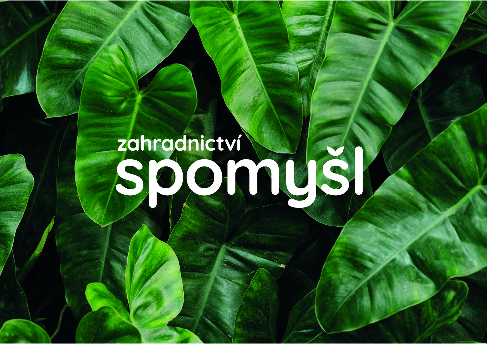
*logo example*

- - -

#### Logo
I wanted to simplify the logo more. The new logo is only typographical – Quicksand font, to enhance freshness and elegance. A combination of two leafs replaced the hook.

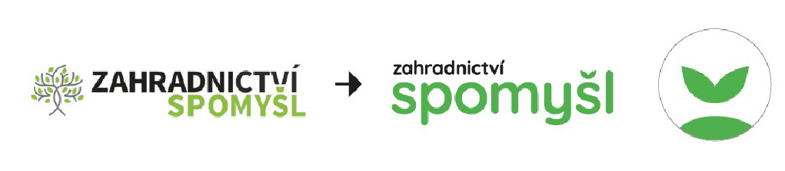
*BEFORE and AFTER*

- - -

#### Colors and new pattern
I kept the color combination of black and green. However, I opted for a different green to make it more vibrant.

 Since the beginning of the creation, I wanted to create something that would differ from other horticultures. For this reason I created a pattern made of leaves that accompanies the entire graphic.
 
 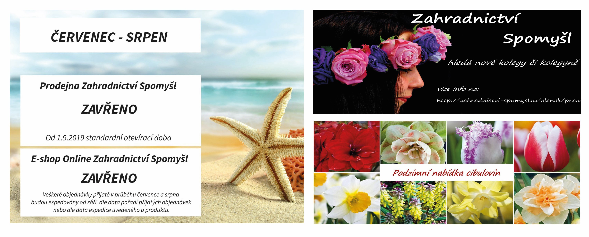
 *old posters*
 
 
 *new posters*
 
 
 *new packaging*
 
 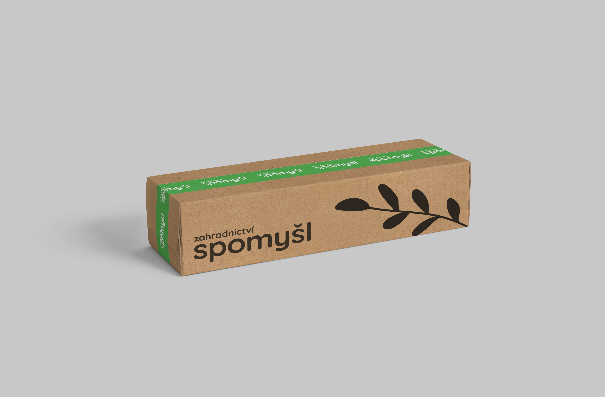
 *new packaging with tape*
 
 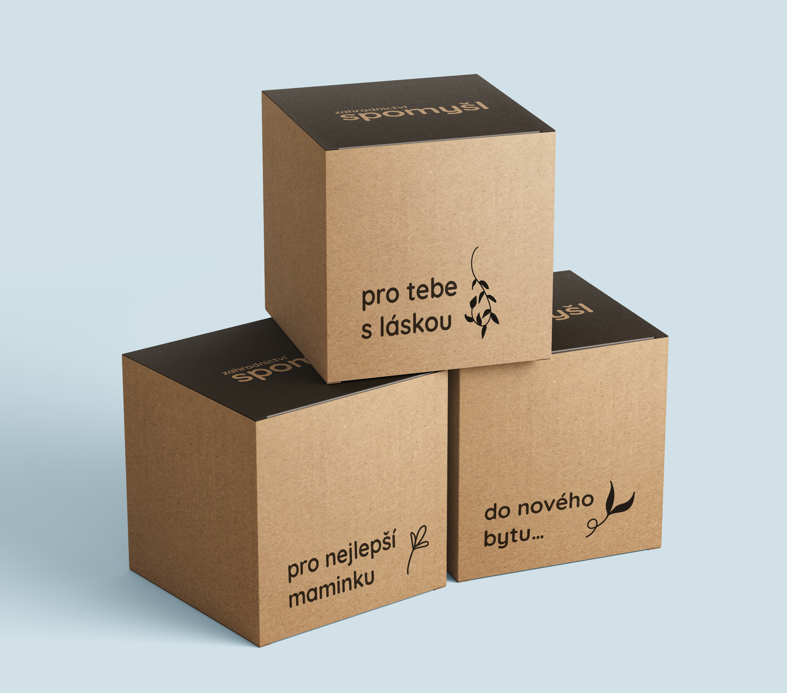
 *gift packaging*
 
 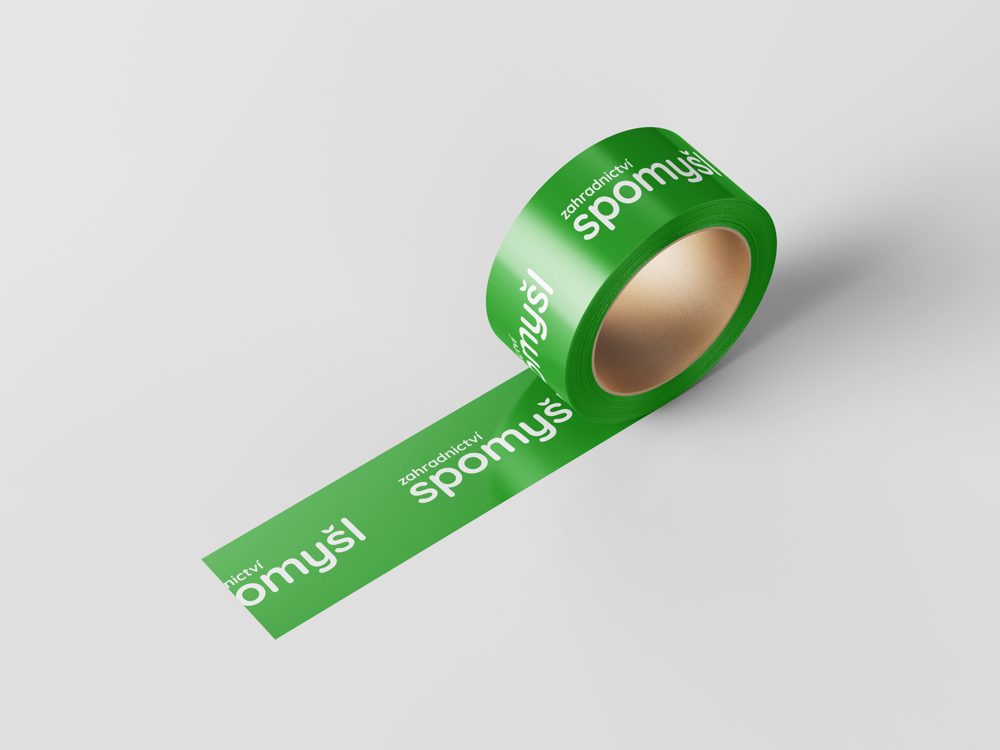
 *green tape with logo*
 
 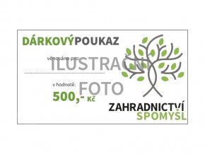
 
 *old gift voucher*
 
 
 *new gift voucher*
 
 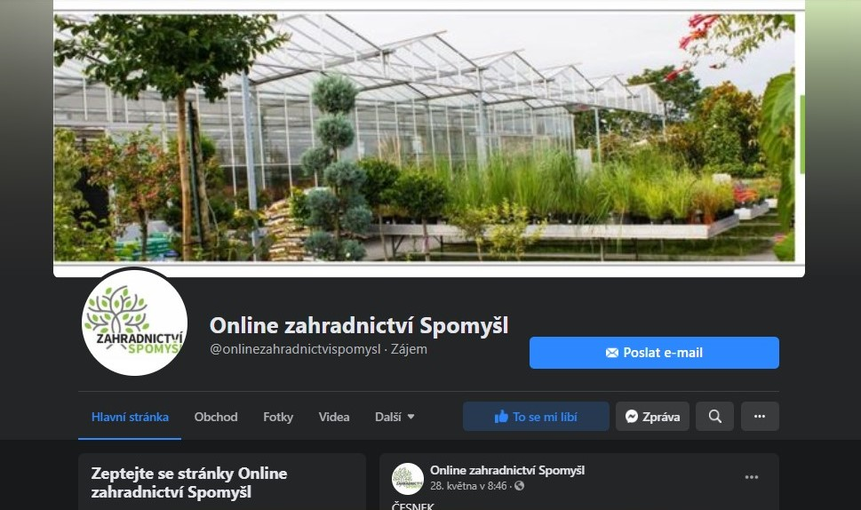 
 *old facebook*
 
 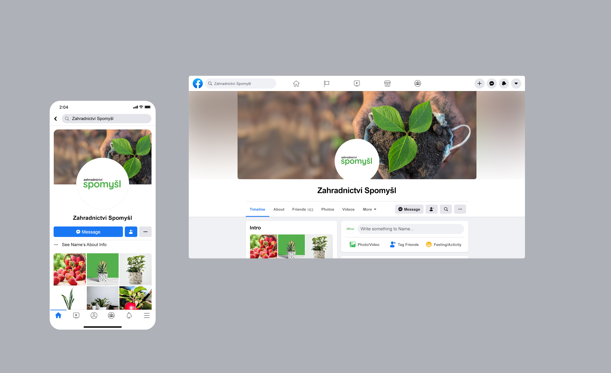
 *new facebook*
 
 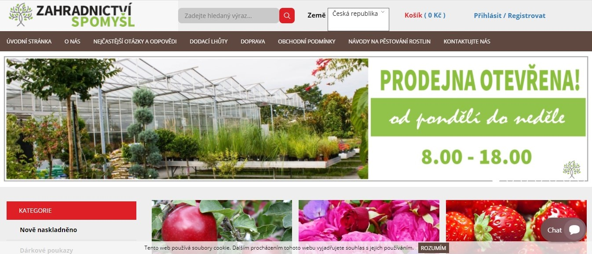 
 *old website*
 
 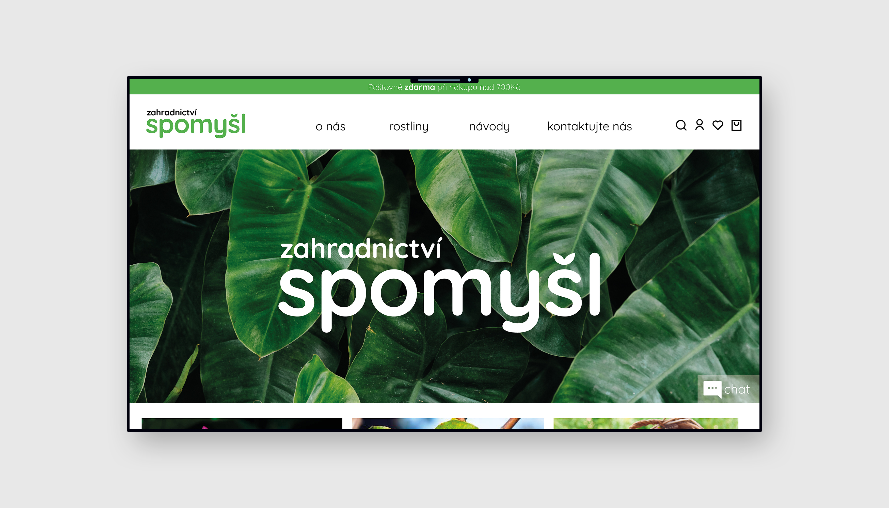
 *new website*
 
 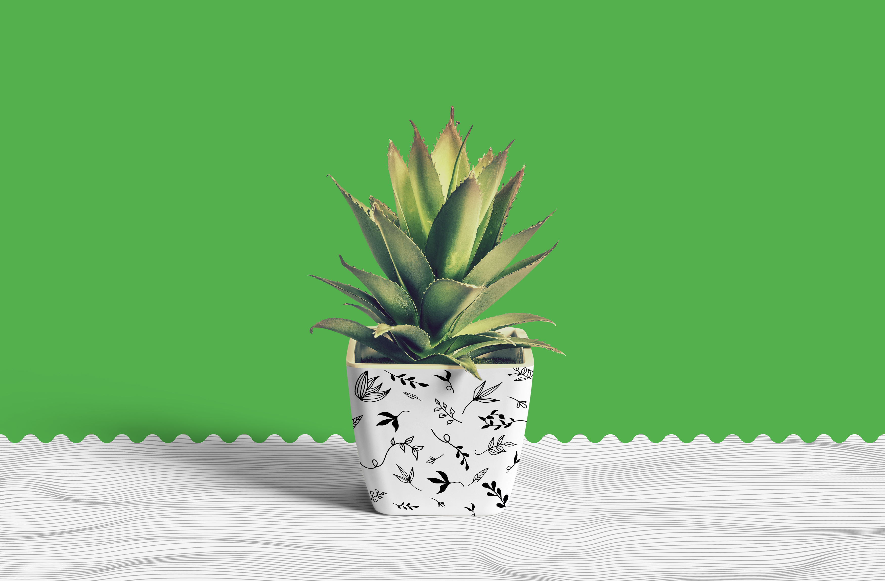
 *flower pot with pattern of leafs*
 
 
 *apron for workers*
 
 - - -
 
This was only a school project, but I still decided to add it here because I gained a lot of new experience on this project. I also enjoyed this work very much and wanted to share it with you. And of course, if possible I would like to offer it to this horticulture. 😊
It takes me about a month to create this new visual identity. 
