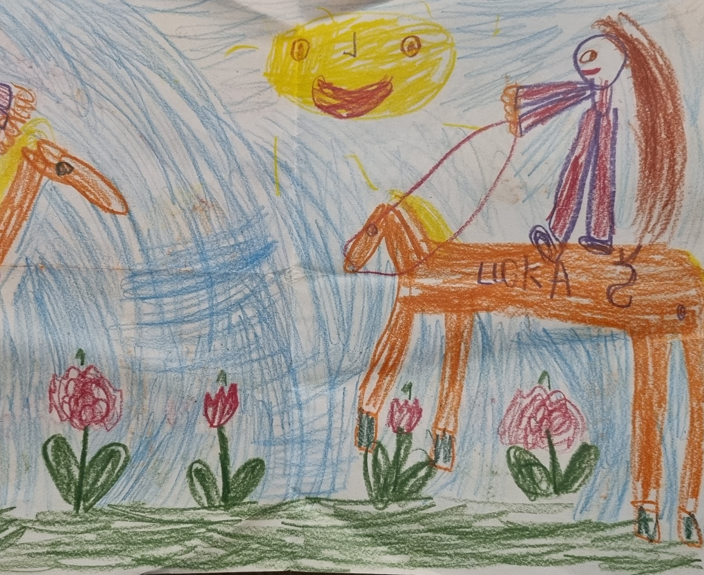

# Content first

## About me
Hi again, I'm Lucie (Lucy)! 
I'm graphic designer and illustrator and my favorite companion at work is 🍷… just kidding… I prefer white wine. 😜

# My story 

.jpg)

Already as a child, I enjoyed drawing. That's why I started going to Art school of Jindřicha Pravečka, where I developed my skills in drawing and painting.  It wasn't until high school that I learned how to work with programs like photoshop and illustrator. Through this school, I have learned what I enjoy and what I want to do in my future. 

Besides, I like to spend time with my family and friends and maybe that's one of the reasons I do all my work at the last minute. 

...and here, at the age of 5, my artistic career began to appear! 😅
