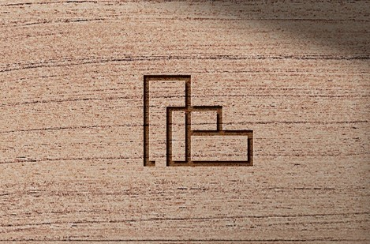

# Content first

## About me
Hi again, I'm Lucie (Lucy)! 
I'm graphic designer and illustrator and my favorite companion at work is 🍷… just kidding… I prefer white wine. 😜

## My story 

.jpg)

Already as a child, I enjoyed drawing. That's why I started going to Art school of Jindřicha Pravečka, where I developed my skills in drawing and painting.  It wasn't until high school that I learned how to work with programs like photoshop and illustrator. Through this school, I have learned what I enjoy and what I want to do in my future. 

Besides, I like to spend time with my family and friends and maybe that's one of the reasons I do all my work at the last minute. 

...and here, at the age of 5, my artistic career began to appear! 😅

## Case study

### Bydlení Brusy

Before I start talking about Bydlení Brusy, I have to mention something about Základy bydlení.
Základy bydlení is company creating modern family living. They are based in Brmo and focuses on reconstructions and new-builds. For this company I have created a new visual identity in the past.

Bydlení Brusy is a project that comes under the company Základy bydlení. It's project of new-builds 4 terraced apartment buildings and 24 single-family houses in Rosice.
And for this project they asked me for a new logo. 
- - -
DATES

July 2022–November 2022
- - -
FIRST BRIEF

The client described in an e-mail that the apartment buildings would be in nature by the woods and fields where the sun shines.
So they asked me for a simple logo that would have the elements of nature mentioned.
They also wanted the logo be similar, or somehow associated with the logo of Základy Bydlení.

Based on these requirements, my first version of the logo was this.
- - -
MY FIRST TRY

logo_1

logo_2

logo Základy bydlení

As you can see, the logo for Bydleni Brusy is based on the logo ZB, with the element of a tree added here to suggest a forest.
Green color again because of the nature.
There is a hidden letter Z in the house for ZB, so even in the new logo has a hidden letter B in the house.

It is also necessary to mention that during the creation of the logo they were still not sure what the name of the project would be. So they were deciding between "Pohledy Brusy" and "Bydlení Brusy" and they asked me for both versions so that they could make a better decision.

After sending it, I got an email within an hour that the lady was completely satisfied that it was exactly how she had imagined it. She also mentioned in the email that she would show it to the rest of the team and let me know.

I THOUGHT IT WAS FINISHED AT THAT MOMENT, BUT I WAS VERY WRONG 😄 !!!

In the next hour, I had a call with the owner of the company that offered me this job in the first place and told me that she was not at all satisfied with the logo. She didn't want nature, nor did she want it to be similar to the logo of Základy bydlení.

So she asked me to make another logo that will be completely different from Základy bydlení. Also they had decided on the name Bydléní Brusy and they would like to have at least one letter B in the logo, preferably two.

- - -

SECOND VERSION OF LOGO

Logo 2

Logo 2_Dark background

After sending this version it was wrong again, because the whole office started deciding on the choice of logo. There were five people + the owner of the company, and to make matters worse, everyone had a different idea of how the logo should look. So, for example, if three people liked this logo, the rest were not happy with it and wanted something else.
So, this version was too clumsy for them and they wanted to return to the style of lines again, as was the case with the logo ZB.
So they contradicted each other every now and then.

So I got a request to make a house from the lines where there will be two letters B, using the same colors as in Základy Bydlení.

Thus, my patience was running out, but I created another version in the hope that it would suit them.

- - -

MY DESPERATE THIRD VERSION OF LOGO

Unfortunately…Even this version was not enough for them and they started to come up with other changes again.
So after it I suggested that it cannot be done like this and that an online meeting is really needed (as I said at the beginning).

- - -

FINAL DENOUEMENT

The entire team from the office was at the online meeting.
After about an hour, we got to the core of the problem - that first they must decide together on some common idea.
Despite the fact that even during the call they managed to disagree three times. 😄
During this call, I also asked them if their houses were anything special, after which they sent me suggestions of what they would look like. I was shocked.
None of the apartment buildings had a roof, so it was clear to me at that moment that we could not go this way.
At the end of the call, they agreed that this call should have been made at the beginning, and that it really wasn't enough to write in a few sentences an idea of one of many.

Final version (FINALLY)

Final logo

Final logo on dark background

- - -

WAY TO LOGO:

During the call, I also learned from one of them, that they would like a symbol that could work on its own. So in that housing area it could be found on a mailbox, or on a bench.

Symbol on wood

Symbol on metal

I also created a long explication for this logo, similar to the logomanual, to really achieve understanding and ideas:

"THIS IS THE BEST THING FOR YOU!"

an example of how the logo would look on paper

- - -

WHAT HAPPENED THEN?

After sending it, I got no response for a week, and I was beginning to worry about what the problem was. But then on beautiful sunny afternoon, I got a call from a client, saying that everyone was happy, that she was sorry for the complications, and that she thanked me very much.
We arranged the remaining details and everything went smoothly. In the coming months I will be creating another works for them, such as letterhead, business cards, etc. 

This whole project has been quite challenging for me, especially mentally. However, after our online meeting, I was clear and enjoyed the creation of the final version logo. 😊

