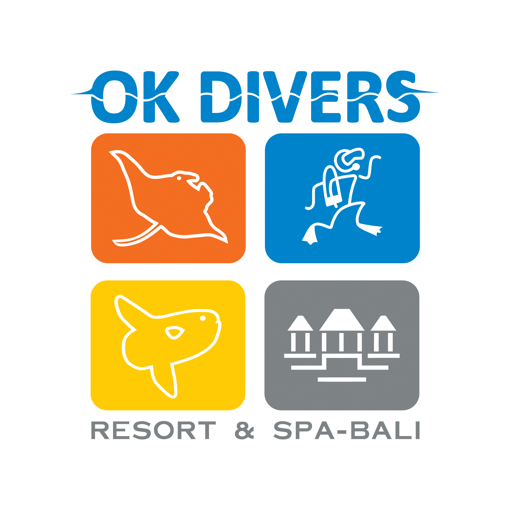

# THE TIME WE HAVE
by Lucie Šebestová

This storytelling is about the limited time we have in our lives. 

It isn't going to be like that movie IN TIME, where everyone has time on their hands to pay rent and stuff.
Nevertheless, I would like to remind you in this form here that life is not infinite and therefore we must enjoy it as much as possible. 

Dig deep into your life and enjoy it in mouthfuls!

Are you ready for the DIVE?
LET'S DO IT!

- - -

- If you're wondering how I got to this final version, here is my [process](process.md).

- - -

## HELLO!
So, at first… Hi! My name is Lucy, as you all probably know.
…I study graphic design at the University of Prague. During my studies I work as an external graphic designer for a housing company. Besides, I like to create various illustrations from realistic crayon drawing to digital drawing. 
In my free time, I like to read, spend time with my friends and explore new things.
It was through travelling that I discovered the magic of diving. 

I officially did my Open Water Diver course in Bali in 2016. 
My instructor was Chris Bush, a great guy by the way. 😄
He was fun. If you ever want to meet good people abroad, divers are the obvious choice!
They're all cool and you never get bored with them. I PROMISE. 

### About the course (Open Water Diver)
This course officially allows me to dive to a depth of 12 meters. This course included a written test and a practical underwater test where, for example, we had to remove our diving goggles, put them back on and get rid of the excess water left in them.

## WHAT WILL BE MY STORY ABOUT?
I will talk about THE TIME WE HAVE. The reason why I chose to talk about this topic is that nothing in our lives is constant. Everything is changing, nothing is everlasting, and neither are we here forever. None of us are…

But…don't worry, I don't want to stress here and create some feelings of depression and fear of what's coming. 😜 My intention is to make you aware of a few things that I often forget, too. 

## HAVE ANY OF YOU EVER DIVED? 
This question may be a little confusing, but I will still ask... Have any of you ever dived?
Some of you might, some of you might not. If not, never mind. We are in a specialization where imagination and creativity plays a big part, so you can certainly use your imagination to the full.

You may be wondering what our time has to do with diving. But you would be surprised at how closely they can be related.
When you dive and you are under the water, you have just short time to explore all the beautiful things under the water, and it’s like our life. 
And that’s what I want to talk about today.

- - -

But…let's start at the beginning. Imagine you're on a boat that's tossing from side to side, wobbling to the rhythm of the waves...You might be slightly nauseous and maybe little nervous about it and NOW it's time to get ready for the dive.
In the neoprene with your heavy tank on your back and your fins, that make it hard for you to move…you hobble to the edge of the boat and jump. 

You were just born. 

When all the bubbles are brought to the surface, you can look around and get used to the environment where you are. 

And that's your first phase of your life. 

## WAIT…WHERE AM I?
So, when you get used to environment, you make your own moves to look around and find what you can explore. And the whole ocean is SO huge, and it's only up to you, where you will dive and what you will see – and same thing is with your life.

YOU decide what you gonna do.

YOU look for what you like.

And YOU decide how you spend your time, that is limited. 

So, let's move a little. For each dive, the diver has an average of 45 to 60 minutes per dive. It depends on the depth of the dive and the experience of the diver.
The deeper you go, the faster you draw your oxygen from the tank and reduce your dive time. That's why you have to be deliberate about how you handle your time underwater. Another important factor is calm and balanced breathing and movements. If you chase for everything, you'll only breathe superficially…you're doing yourself a disservice. You're robbing yourself of the time you've been granted. 

Again, it compares to our life. It's like if you chase recklessly after stupid things and don't realize what is important. Stop fretting about what anyone thinks of you. Or how many followers you have on Instagram. Just don't waste your time on silly things. 
Don't be so much on social media. Don't waste your time watching for hours some stupid videos on TikTok etc.… Go out! Know the beauty of life. Even a short walk-in nature is better than staring at your phone or tv. Of course, you need to switch off from time to time, and that’s okay, but everything in moderation.

…Likewise, you won't stand at the same place still for 40 minutes while you dive. You have to move and look around. So while dive you can met a lot of great and beautiful things.

- - -

Like this for example…All those colorful fish, beautiful coral reefs, and the sun's rays, which appear alternately below the surface. All these things can be considered the beautiful moments in our lives.
It’s like If the guy we liked and we were eyeing him all the time and he finally ask us out on a first date.
Or if we have a nice evening with our family, or if we can finally add a picture to the github and find it wasn't that complicated. 
It could be anything. Everyone has something that puts a smile on their face. Even the silly little thing of just smiling at someone strange can make the person's whole day better.
So let's cherish moments like this and enjoy them.

- - -

Just as we can meet colorful fish underwater, we can also meet this slightly bigger fish.
And it can be compared to the bad things, that sometimes happened in our life. 
But it is important to realize, that some accidents, that might happen to you, they maybe look terrifying, but the situation is not that bad, as you can see it.
When you met a shark in the water while you’re diving, he usually doesn’t care about you. It's not TADAM TADAM TADAM like in movie jaws. The shark is not just a starving jaw that wants blood and eats all the divers that appear around it... Of course, it is a predator and it CAN BE dangerous, but most attacks on humans have been caused by mistaking humans for seals, especially surfers.

And in life it’s like when you failed the exam… you think about it, like you’re all live is ruined, you are sad, but it is not that bad. You can have second chance; you will prepare more and you’ll make it.

Sometimes things just aren't going our way, but we can't get out of it right away.
Life brings much, good and bad... Sometimes we just run into some assholes who annoy us and want to do us harm, but we have to deal with them.
In some these situations can help a good friend and a glass of wine; and it is enough for situations like this, where you can talk things through out. 

I myself once encountered a shark in a dive and I'm not going to lie, I was a little apprehensive, but as I say, it just sailed past us, minding its own business.

- - -

About the unpleasant situations that can happen during a dive, my own experience came to my mind, which was far worse for me than encountering a shark. 
During one dive, we were diving in Egypt, I think, with a larger group of people.

At the beginning I should mention that when you dive you can see below and around you, not above yourself, that is quite difficult.
That's why when you're diving in multiple people, it's important that you don't try to get ahead of someone from the top, because they most likely have no idea that you're above them. 

And that's exactly what one diver did to me by mistake. The fact that I was quite surprised wasn't so bad, what was worse was that during the time he got in front of me, he tore off my diving goggles and my breathing regulator with his flipper. 
I totally freaked out. 
But do you remember when at the beginning of the presentation I told you about my practical test of open water diver? 
Part of the test was taking off the mask, or the ragulator, and they wanted that knowledge for us precisely because of situations like this that could just happen.
So even though I didn't see, because of the water, the first thing I did was looking for my regulator.

To find a regulator, we've been learning a pretty useful trick, and with this trick, you don't even have to see. 

### And it's done like this:
You use your right hand, because a hose from your regulator is connected to the tank from right side, and you go from your leg up. 
And wherever the regulator is, its hose will appear on your shoulder, where it can be easily felt and reinserted. 

Then I blew out the excess water, put on the glasses my dad handed me in the process, got rid of the excess water, and that was it. 
By the way, for this reason, you have your buddy assigned to you every time you dive, with which you control each other. On this dive, of course, my buddy was dad, who noticed this situation in time and helped me in any way he could.

The diver, that did this to me, was kind of jerk, cause when we were after the dive on the boat, he just smiled and barely apologized to me, like nothing happened. 

Even these things can happen. That's just the way it is. 

- - -

So, what now? 
Life is fleeting, enjoy it…Take advantage of the opportunities that come your way.

Shit happens and it will happen, but the important thing is don't screw yourself up!

If you've read this far, congratulations! 🥳 (And thank you for your attention 🥹).
Bye!
