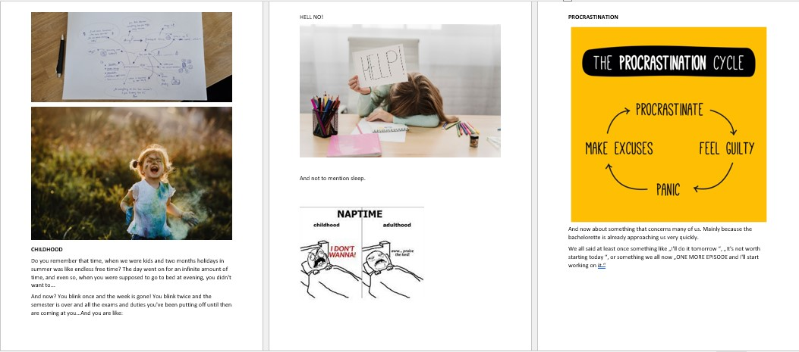
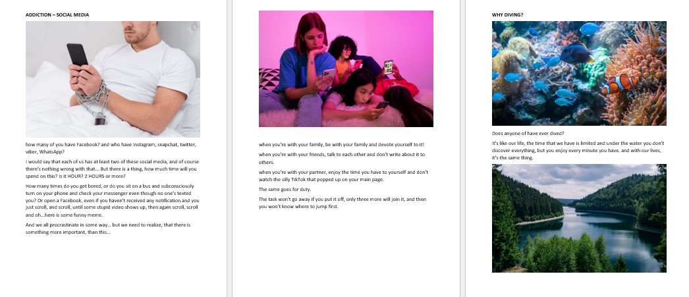
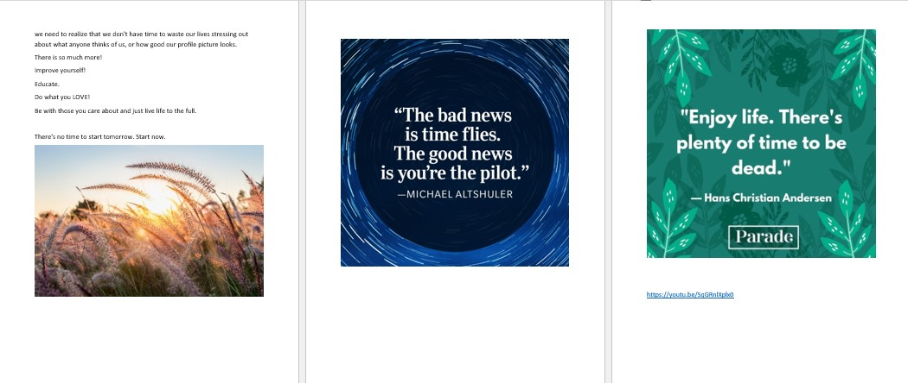
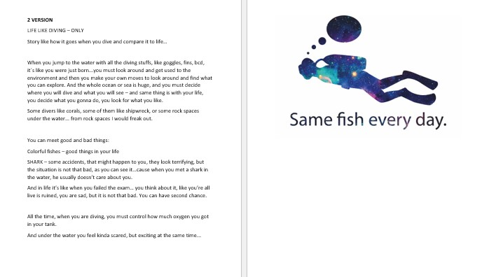

# THE TIME WE HAVE
## Process

Hi!

So at first...I tried „OPEN MODE“ and at first time I fell asleep 😆, but on the second try I was thinking about our life, about procrastination, addiction to social media and life in general atc.
I put it in my mind map and then it come to my mind, that MAYBE I would like to to talk about THE TIME WE HAVE, as we have limited time.

I started to develop my topics in Word to make clear what way I'm going to choose and it was really messy.
I writed all my thoughts in points and also add accompanying pictures to my thoughts.

After this I started to think about how similiar is the diving and life. So I wanted to let my presentation
And this idea came to my mind, when I remembered about diving, where you have just short time to explore all the beautiful things under the water, and it’s exactly like our life.

### Presentation

So I started working on my presentation and preparing my speech.

- Read [the article](index.md) 
