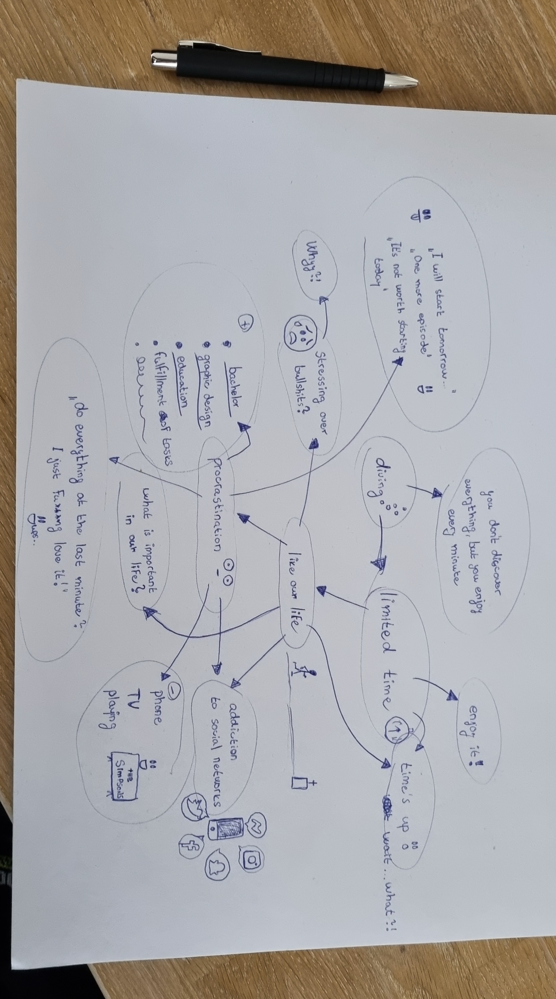

# THE TIME WE HAVE
## Process

Hi!

So at first...I tried „OPEN MODE“ and at first time I fell asleep 😆, but on the second try I was thinking about our life, about procrastination, addiction to social media and life in general atc.
I put it in my mind map and then it come to my mind, that MAYBE I would like to to talk about THE TIME WE HAVE, as we have limited time.

And this idea came to my mind, when I remembered about diving, where you have just short time to explore all the beautiful things under the water, and it’s like our life.

- Read [the article](index.md) 

<!-- Treat this as the case study to your article/talk/presentation. Document, discuss, and show your process (mind maps, chunking, draft and revised content, links to resources, etc.) -->
<!-- Preparing a conference talk: https://adactio.com/journal/14363 -->
<!-- A refresher about case studies: https://thegymnasium.com/courses/take5/taking-your-portfolio-case-studies-to-the-next-level
