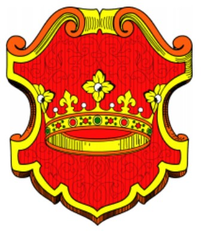
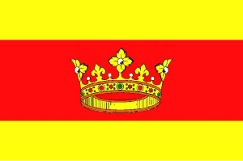
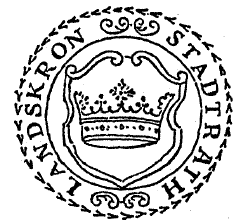
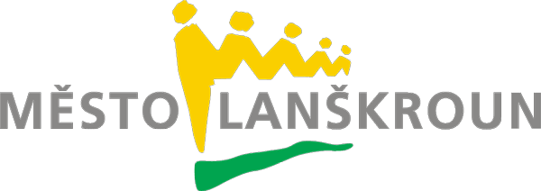
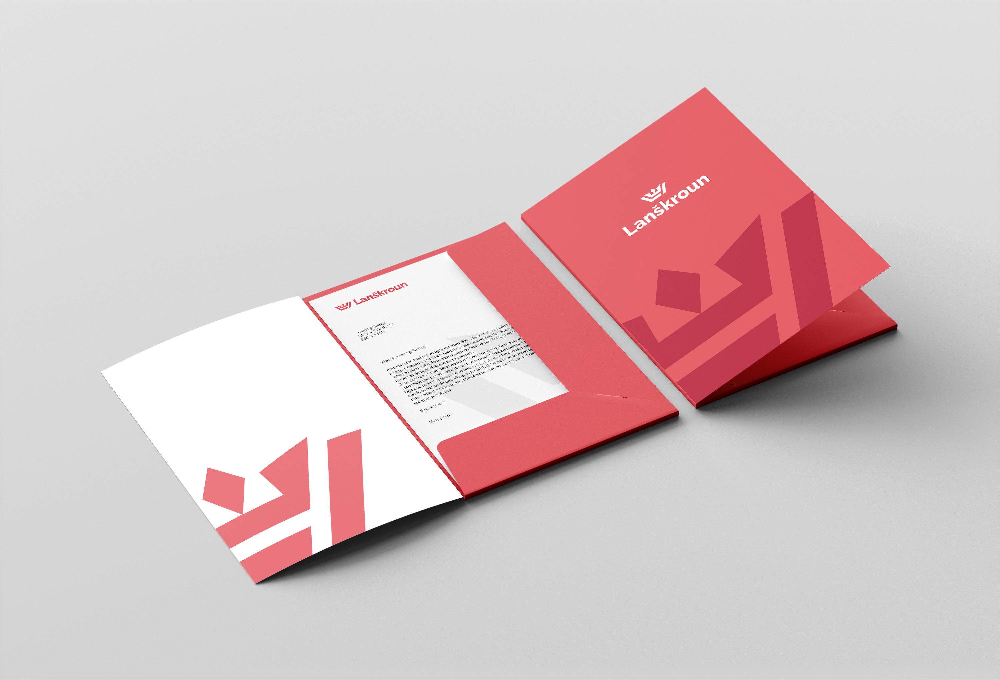
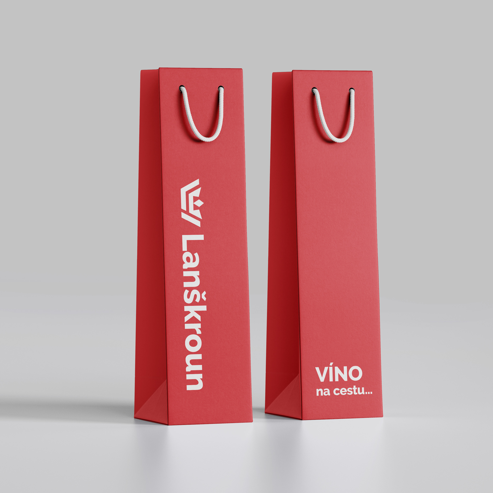

# Thesis presentation

# The visual identity of Lanškroun

## About the city
- founded in the  13th century
- 10 178 inhabitants
- region Pardubice

Lanškroun is a city of electronics, engineering, and the paper industry as well as a city of secondary schools, vibrant culture and modern sports fields.

## Landeskrone
"land crown"

|  |
|:--:|
| *emblem* |

|  |
|:--:|
| *flag* |

|  |
|:--:|
| *stamp* |

### Actual visual identity

|  |
|:--:|
| *Actual logo of Lanškroun* |

The city has an incoherent identity, using an outdated logo. They also often replace the logo with an emblem. Another drawback of the logo is that it is a rectangular logo. The city also doesn't hold the same color, and they often work with the colors from emlbem, instead of the logo.

## New visual identity

|  |
|:--:|
| *Symbol of Lanškroun* |

Symbol contains of the crown and the letters LA. 😜

|  |
|:--:|
| *Notebook of Lanškroun* |

|  |
|:--:|
| *Stationery* |

|  |
|:--:|
| *Stationery* |

|  |
|:--:|
| *Wine bag* |

If you want to see more, click NOT YET! 

And if you want to hear my speech and learn more, come to class.
